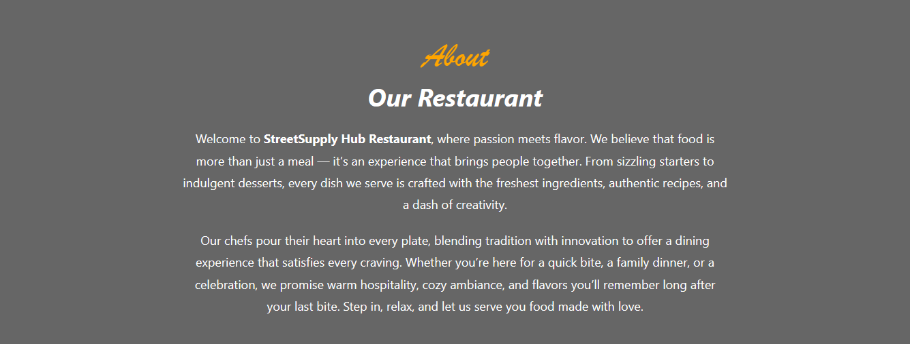
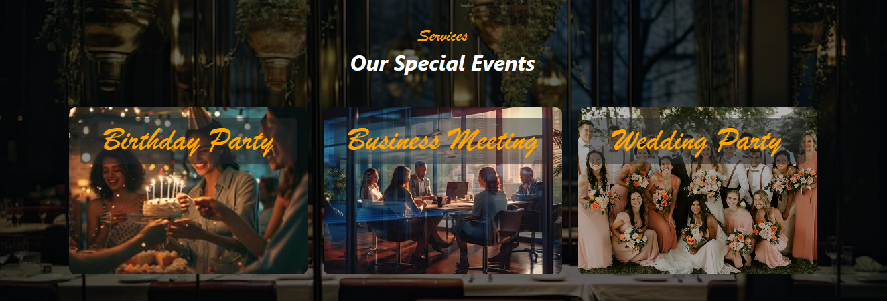
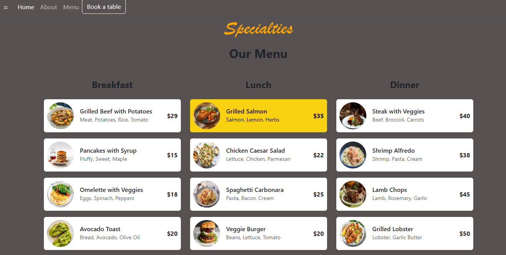
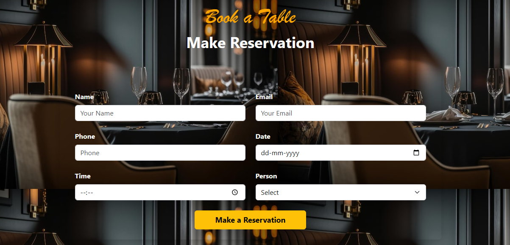
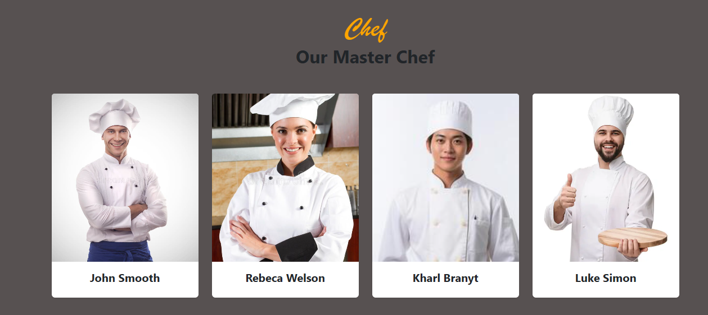

# StreetSupply Hub Restaurant Landing Page 🍽️

A modern, elegant, and fully responsive single-page website template built for restaurants, cafes, and culinary hubs. This landing page features a sleek design with smooth navigation, beautiful imagery overlays, and interactive hover effects.

---

## 📸 Project Screenshots

Take a visual tour of the **StreetSupply Hub Restaurant** landing page:

### 🌟 Hero Banner & Navigation
The landing page opens with a striking, full-screen hero carousel featuring responsive navigation links and explicit Call-to-Action buttons.


---

### 📖 About & Special Events
A clean introduction detailing the brand philosophy, seamlessly followed by an interactive service section highlighting birthdays, corporate events, and weddings with smooth zoom animations.

| 🏷️ About Our Story | 🎉 Special Events & Services |
| :---: | :---: |
|  |  |

---

### 🍽️ Interactive Menu & Reservations
The dynamic menu features beautifully structured rows for breakfast, lunch, and dinner with hover highlights. Right below is a stylized, functional custom booking form layout.

| 📜 Categorized Menu | 📅 Table Booking Form |
| :---: | :---: |
|  |  |

---

### 👨‍🍳 Meet Our Culinary Team
A uniform grid displaying the expert master chefs driving the restaurant's top-tier kitchen operations.


---

## ✨ Features

* **Dynamic Transparent Navbar:** Stays fixed at the top and seamlessly changes to a solid background upon scrolling.
* **Hero Carousel:** A full-width responsive banner displaying featured slogans and clear call-to-action buttons.
* **About Section:** A stylized presentation area introducing the restaurant's passion and philosophy.
* **Special Events & Services:** Card grids highlighting special events like birthday parties, corporate meetings, and weddings with zoom and overlay animations.
* **Categorized Menu & Specialties:** Clean, structured grids for Breakfast, Lunch, Dinner, Desserts, Ice Cream, and Drinks that highlight dynamically on hover.
* **Table Reservation Form:** A sleek, fully stylized user-friendly booking layout.
* **Meet the Chefs:** Section highlighting the core culinary team with uniform picture framing.
* **Testimonials:** Clean customer feedback cards set against contextual background imagery.
* **Comprehensive Footer:** Includes business operation hours, an integrated newsletter subscription card, and an Instagram image gallery grid.

---

## 🛠️ Tech Stack

* **HTML5** - Structured content markup.
* **CSS3** - Custom styling, smooth transitions, card overlays, and font configurations.
* **Bootstrap v5.3** - Responsive grid system, carousel components, navigation utilities, and form styling.

---

## 📂 Project Structure

```text
├── index.html          # Main HTML entry point (can be named boots.html)
├── README.md           # Project documentation and presentation
├── screenshots/        # Directory containing public preview images
│   ├── 1.jpg
│   ├── 2.png
│   ├── 3.jpg
│   ├── 4.png
│   ├── 5.jpg
│   └── 6.jpg
├── project1Restaurant/ # Auxiliary assets folder
└── [other local asset images...]